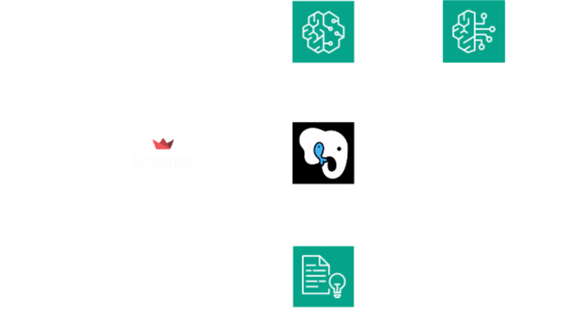

# Hotel Recommendations using pgvector, Babelfish for Amazon Aurora PostgreSQL, Aurora ML and Amazon Bedrock

This repository showcases the essential building blocks for creating an enterprise-ready Retrieval-Augmented Generation (RAG) application, specifically for Hotel Recommendations. We leverage a combination of various AWS services, including [Amazon Bedrock](https://aws.amazon.com/bedrock/), a streamlined approach to building and scaling generative AI applications with foundation models. We employ [Titan Text](https://aws.amazon.com/bedrock/titan/) for text embeddings and [Anthropic's Claude on Amazon Bedrock](https://aws.amazon.com/bedrock/claude/) as our Large Language Model (LLM). Additionally, we utilize the [pgvector extension on Babelfish for Amazon Aurora PostgreSQL](https://docs.aws.amazon.com/AmazonRDS/latest/AuroraUserGuide/babelfish-postgres-aws-extensions.html#babelfish-postgres-aws-extensions-using-pgvector) as our vector database, and Aurora ML for generating embeddings by invoking Amazon Bedrock LLMs from database context. Furthermore, we incorporate sentiment analysis for hotel reviews by integrating with Amazon Comprehend. 

## Prerequisites
Before running the notebook, make sure you have the following: 
1. [Set up a Babelfish for Aurora PostgreSQL DB cluster](https://docs.aws.amazon.com/AmazonRDS/latest/AuroraUserGuide/babelfish-create.html). PGVector with Babelfish extension is supported for PostgreSQL 15.7 and 16.3 onwards.
2. Set up an [Amazon Elastic Compute Cloud](http://aws.amazon.com/ec2) (Amazon EC2) instance in a public subnet, which will act as a front end and can access for database. For instructions, refer to [Tutorial: Get started with Amazon EC2 Linux instances](https://docs.aws.amazon.com/AWSEC2/latest/UserGuide/EC2_GetStarted.html).
3. Create an [AWS Secrets Manager](https://aws.amazon.com/secrets-manager/) database secret for the application to access Aurora. For instructions, see [Create an AWS Secrets Manager database secret] (https://docs.aws.amazon.com/secretsmanager/latest/userguide/create_database_secret.html).
4. The EC2 instance will need access to the Aurora cluster and Secrets Manager. Refer to [Creating a role to delegate permissions to an AWS service](https://docs.aws.amazon.com/IAM/latest/UserGuide/id_roles_create_for-service.html) for the steps to create an AWS Identity and Access Management (IAM) role and attach specific policies granting access to your Aurora cluster and Secrets Manager.
5. [Enable Amazon Bedrock access](https://docs.aws.amazon.com/bedrock/latest/userguide/model-access.html). You may need to request access to use specific foundational models in Amazon Bedrock. In this blog post, we used Anthropic Claude 2 and Amazon Titan Embeddings G1 – Text.

## Architecture



## How It Works

The application follows these steps to provide responses to your questions:

1. **Hotel data initialization**: The script `db-init.sql` consists the hotel dataset, and reviews. We use GUI-based client tool `SSMS` to load data into Babelfish for Amazon Aurora PostgreSQL cluster. It will create a new schema `hotel` and set of tables - `hotels` and `reviews`.

2. **Embedding**: The function `aws_bedrock.invoke_model_get_embeddings` is used to generate embeddings from hotel data that already exists in your database. The generated embeddings are stored in `hotel.hotel_embedding` vector column.

3. **Hotel Suggestions**: When the user searches for a hotel, the app compares the search keyword in the context of hotel name, description and overview in `hotel.hotel_embedding` vector data and recommends matching hotels.

4. **Reviews Summary**: The function `aws_bedrock.invoke_model` is used to generate summary of all the reviews for a given hotel.

## Dependencies and Installation

To build the Hotel recommendations app with pgvector and Babelfish for Amazon Aurora PostgreSQL, please follow these steps:

1. Clone the repository to your front-end EC2 instance, created in prerequisites steps.
   
2. Install the Microsoft ODBC driver for SQL Server version 18 or above, using steps mentioned [here](https://learn.microsoft.com/en-us/sql/connect/odbc/linux-mac/installing-the-microsoft-odbc-driver-for-sql-server).
   
3. On the Amazon EC2 console, attach the role created in the prerequisites that provides the EC2 access to Aurora and Secrets Manager.
   
4. Replace the database secret (created as prerequisite) in the code so that your application can fetch the database endpoint and credentials for your Aurora database.
   
5. Make sure Python 3.10 or above is installed on Amazon EC2. This Python version comes with pip3 installed by default.

6. Install the required dependencies by running the following command:
```
pip install -r requirements.txt
```

## Usage

To use the Hotel recommendations app with pgvector and Babelfish for Amazon Aurora PostgreSQL, follow these steps:

1. Ensure that you have installed the required dependencies mentioned above.

2. Ensure you have installed the extension `pgvector` on your Babelfish for Amazon Aurora PostgreSQL cluster sys schema:
   ```
   exec sys.sp_execute_postgresql 'Create extension vector with schema sys';
   ```

4. Ensure you have installed the extensions `aws_commons` and `aws_ml` on your Babelfish for Amazon Aurora PostgreSQL cluster:
   ```
   exec sys.sp_execute_postgresql 'CREATE EXTENSION aws_commons;
   exec sp_execute_postgresql 'create extension aws_ml';
   ```

5. Analyze the sentiment of hotel reviews using Amazon Comprehend:
   ```
   UPDATE master_hotel.reviews
    SET sentiment = (aws_comprehend.detect_sentiment (review, 'en')).sentiment,
        confidence = (aws_comprehend.detect_sentiment (review, 'en')).confidence
    WHERE
        reviews.review IS NOT NULL AND
        LENGTH(TRIM(reviews.review)) > 0 AND
        reviews.sentiment IS NULL;
   
   ```

6. Generate vector embeddings for Hotel details like Hotel name, overview, description etc:
   ```
   exec sys.ss_generate_hotel_embeddings_forall ;
   
   ```
  
6. Run the `app.py` file using the Streamlit CLI on your front-end EC2 instance. Execute the following command:
   ```
   streamlit run ./app.py --server.port 8080
   ```
## Ouput

Sample output for the application:

1. To search for hotels, provide a descriptive keyword like 'beach'. The Babelfish for Aurora PostgreSQL database will perform a semantic search, leveraging vectorized representations to find relevant hotels that match your specified criteria.


2. The application will present relevant additional results based on your search criteria.


## Contributing

See [CONTRIBUTING](CONTRIBUTING.md#security-issue-notifications) for more information.

## License

This library is licensed under the MIT-0 License. See the [LICENSE](LICENSE) file.
